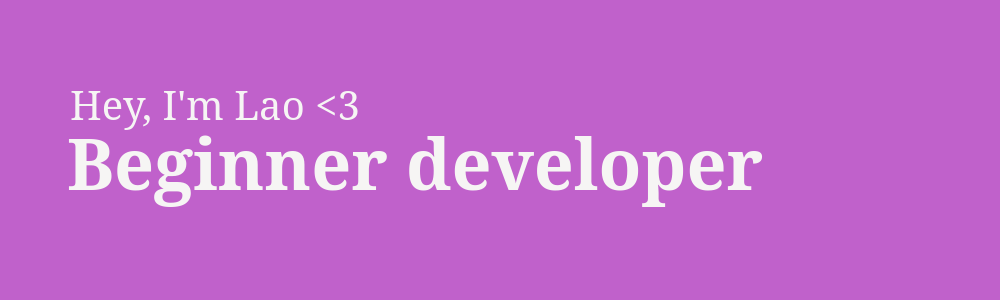

---

**Hi! I’m a beginner programmer eager to learn and grow.**

I’m passionate about building apps, games, and tools. I’m focused on improving my skills and creating impactful, efficient solutions. Every day is a chance to learn and develop as a developer.

# 💻 Tech Stack:
### Well-versed In:
    

### Currently Learning:
      

# 📊 Stats:

### ✍️ Random Dev Quote

---
